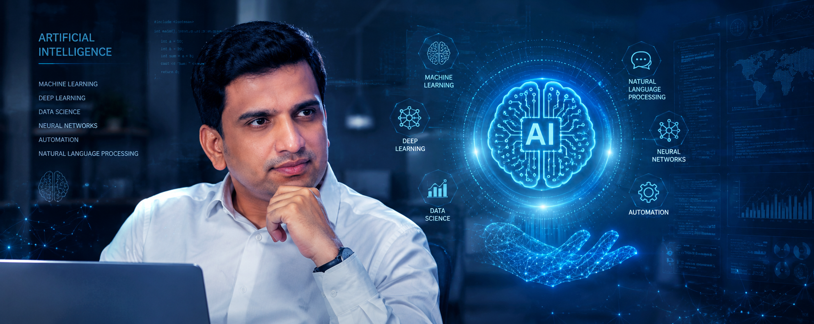

---
hide:
  - toc
  - navigation
---

  

    
Hi, I'm Raj 👋

    <h1>I share ideas on GenAI, LLMs, AI Architecture, Cloud Solutions, Enterprise Technology, and Modern Engineering</h1>
    
20+ years of experience building scalable applications, leading engineering teams, and exploring the future of AI and Cloud technologies.

    

      <button class="btn-primary">Latest Articles →</button>
      <button class="btn-secondary">About Me</button>
    

  

  

    
  

---

## Featured Articles {#featured}

  

    
AI & GenAI

    <h3>Generative AI & LLMs</h3>
    
Explore generative AI fundamentals, large language models, prompt engineering, RAG systems, and building production-ready AI architecture with governance.

  

  

    
Cloud & DevOps

    <h3>Enterprise Cloud Architecture</h3>
    
Deep dive into cloud platforms, containerization, Kubernetes, infrastructure as code, and cloud-native delivery patterns for enterprise scale.

  

  

    
Architecture

    <h3>Enterprise Architecture Patterns</h3>
    
Master microservices, API design, system architecture, enterprise integration patterns, and design principles for building robust scalable systems.

  

> **Last updated: [Timestamp will load]**
